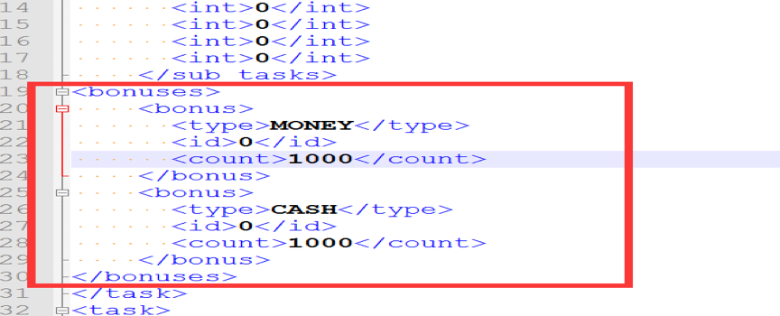

# config loader xml

---------------------------

## dependencies

---------------------------
```xml
<!-- https://mvnrepository.com/artifact/org.simpleframework/simple-xml -->
<dependency>
    <groupId>org.simpleframework</groupId>
    <artifactId>simple-xml</artifactId>
    <version>${simple-xml.version}</version>
    <scope>provided</scope>
</dependency>
```

## usage

---------------------------

* 数据类定义 (对应注解查看 simple-xml)
```java
@Root(strict = false)
public class Task extends Config<Integer>
{
	@Root(strict = false)
	public static class Bonus
	{
		@Element
		public Constant.BonusType type;
		@Element(required = true)
		public int id;
		@Element(required = false)
		public int count;
	}

	@Element
	public int id;
	@Element(name = "desc")
	public String desc;
	@Element
	public Constant.TASK_REFRESH_TYPE task_refresh_type;
	@Element
	public Constant.TASK_FORM_TYPE task_form_type;
	@Element
	public Constant.SUB_TASK_REFRESH_TYPE sub_task_refresh_type;
	@ElementList(entry = "int", inline = false, name = "subTasks", required = false)
	public ArrayList<Integer> subTasks = new ArrayList<Integer>();
	@ElementList(entry = "bonus", inline = false, name = "bonuses")
	public ArrayList<Bonus> bonuses = new ArrayList<>();
	

	@Override
	public Integer getID()
	{
		return this.id;
	}
	
	@Root
	public static class Tasks extends ConfigList<Integer, Task>
	{
		@ElementList(inline = true, entry = "tasksitem")
		private ArrayList<Task> list = new ArrayList<>();

		private Map<Integer, Task> map = new HashMap<>();

		@Override
		protected List<Task> list()
		{
			return list;
		}

		@Override
		protected Map<Integer, Task> map()
		{
			return map;
		}

		@Override
		public void postLoad() throws Exception
		{
		}
	}
}
```

* 加载代码
```java
public class CustomConfigFactory implements ConfigFactory
{
	@Override
	public void registerConfigs() throws ConfigException
	{
		ConfigLoader.registerConfig(Task.Taskes.class, false); 
	}
}
```


### 配置文件格式
```xml
<?xml version="1.0" encoding="utf-8"?>
<tasks xmlns:xsi="http://www.w3.org/2001/XMLSchema-instance">
	<task>
	  <id>100001</id>
	  <name>task_100001_name</name>
	  <desc>task_100001_desc</desc>
	  <task_refresh_type>TASK_REFRESH_DAY</task_refresh_type>
	  <sub_tasks>
	    <int>10</int>
	  </sub_tasks>
	  <bonuses>
	      <bonus>
	        <type>MONEY</type>
	        <id>0</id>
	        <count>1000</count>
	      </bonus>
	  </bonuses>
	</task>
</tasks>
```
### 导出模板说明
* 操作页面(据配置,导出页面)  
excel 第二行为数据字段描述  
每一行代表一条完整数据  


* 默认直接类型


	支持类型参看 simple-xml   
    Date 2010-10-10T10:10:10   
    TimeSpan 0.00:00:00   
    并可以通过实现 Transform 增加自定义类型 


* 模版格式(数据模版配置页面)  
每一行代表一个属性的配置, 每行需要配置缺省值、前缀、后缀、文本名、映射   
每个XML 节点的输出内容为 <前缀> + <数据值> + <后缀>   
<缺省值> 数据值为空时使用此列   
<映射> 映射sheet页的对应的列,值相同则替换为,映射sheet页对应列右边一列的对应值   
<文本名> 本地化文件输出的节点名称   
操作页面相对数据列为空则本字段不导表 操作页面sheet页一行数据中 相对本列右边(正数)或左边(负数)的那一列为空则本列不导出   





* 文件输出配置  
配置导出
文件头、结尾、每条数据开头、结尾、文件生成路径、ID位置（代表id的字段放在操作页面sheet页的第几列）等
模版长度会根据模版sheet页自动生成
路径目录不会自动生成,需要先自行创建
导出文件在插入数据时会被清空
[文件输出配置]

* 映射页(普通数据的类型映射)  
配置数据映射,在导表时应用
[类型映射]

* 映射列表绑定

[展式]

[配置]

[模板]

* 本地化


     *.txt [本地化1]  输出的节点名称 (模版名称_ID_文本名称)
     *.xml [本地化2]

[本地化1]
[本地化2]

## change log

---------------------------
